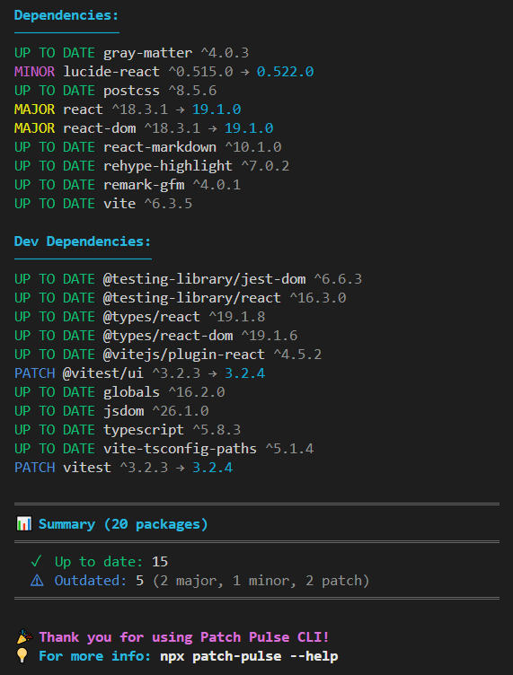

# Patch Pulse CLI

This package lives in the Patch Pulse monorepo at `packages/cli`.

Check for outdated npm dependencies in your `package.json` file.


[](https://npmjs.com/package/patch-pulse)
[](https://npmjs.com/package/patch-pulse)
[](https://github.com/PatchPulse/cli/actions/workflows/ci.yml)


## Quick Start

```bash
npx patch-pulse
```

That's it! Patch Pulse scans your `package.json` and shows which dependencies are outdated.



## Configuration

Patch Pulse supports configuration files for persistent settings. Create one of these files in your project root:

- `patchpulse.config.json`
- `.patchpulserc.json`
- `.patchpulserc`

### Configuration File Example

```json
{
  "skip": ["lodash", "@types/*", "test-*"],
  "packageManager": "npm",
  "noUpdatePrompt": false
}
```

### Skip Patterns

The `skip` array supports multiple pattern types:

- **Exact names**: `"lodash"`, `"chalk"`
- **Glob patterns**: `"@types/*"`, `"test-*"`, `"*-dev"`
- **Regex patterns**: `".*-dev"`, `"^@angular/.*"`, `"zone\\.js"`

### Package Manager

The `packageManager` option allows you to override the package manager detection.

- `npm`
- `pnpm`
- `yarn`
- `bun`

### No Update Prompt

The `noUpdatePrompt` option allows you to skip the update prompt.

### CLI vs File Configuration

CLI arguments override file configuration:

```bash
# This will override any settings in patchpulse.config.json
npx patch-pulse --skip "react,react-dom" --package-manager pnpm --no-update-prompt
```

## Ecosystem

- **🔧 CLI Tool** (this repo) - Check dependencies from terminal
- **⚡ VSCode Extension** ([@PatchPulse/vscode-extension](https://github.com/PatchPulse/vscode-extension)) - Get updates in your editor _(Coming soon)_
- **🤖 Slack Bot** ([Add to Workspace](https://slack.com/oauth/v2/authorize?client_id=180374136631.6017466448468&scope=chat:write,commands,incoming-webhook)) - Get notified in Slack

## Troubleshooting

- **"No dependencies found"** - Run from directory with `package.json`
- **"Error reading package.json"** - Check JSON syntax and file permissions
- **Network errors** - Verify internet connection and npm registry access

## Contributing

1. Fork and clone
2. `npm install`
3. Make changes
4. Submit PR

**Guidelines:** Add tests, update docs, keep commits atomic.

## Support

- ⭐ **Star** the repo
- 🐛 **Report bugs** via [Issues](https://github.com/PatchPulse/cli/issues)
- 💬 **Join discussions** in [Discussions](https://github.com/PatchPulse/cli/discussions)

## License

MIT - see [LICENSE](LICENSE)

## Author

[@BarryMichaelDoyle](https://github.com/barrymichaeldoyle)

**🎥 Live Development:** Sometimes I stream on [Twitch](https://twitch.tv/barrymichaeldoyle) - drop by and say hello!

---

**Made with ❤️ for the Node.js community**
