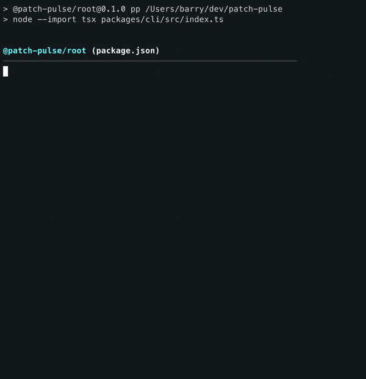

# Patch Pulse CLI

This package lives in the Patch Pulse monorepo at `packages/cli`.

Check for outdated npm dependencies across your project.


[](https://npmjs.com/package/patch-pulse)
[](https://npmjs.com/package/patch-pulse)
[](https://github.com/barrymichaeldoyle/patch-pulse/actions/workflows/ci.yml)


## Quick Start

```bash
npx patch-pulse
```

That's it! Patch Pulse scans the current project for `package.json` files and shows which dependencies are outdated.

Docs: https://barrymichaeldoyle.github.io/patch-pulse/

- Zero runtime dependencies
- Monorepo-aware, including pnpm `catalog:` support
- Interactive terminal updates for patch, minor, or all outdated packages



## Configuration

Patch Pulse supports configuration files for persistent settings. Prefer `patchpulse.json` in your project root. These filenames are supported:

- `patchpulse.json`
- `patchpulse.config.json`
- `.patchpulserc.json`
- `.patchpulserc`

### Configuration File Example

```json
{
  "skip": ["lodash", "@types/*", "test-*"],
  "ignorePaths": ["packages/cli/e2e"],
  "packageManager": "npm",
  "interactive": true
}
```

### Skip Patterns

The `skip` array supports exact names and glob wildcards:

- **Exact names**: `"lodash"`, `"chalk"`
- **Glob patterns**: `"@types/*"`, `"test-*"`, `"*-dev"`

### Ignore Paths

The `ignorePaths` array excludes matching directories or `package.json` paths from workspace scanning:

- **Exact paths**: `"packages/cli/e2e"`
- **Glob patterns**: `"**/fixtures"`, `"packages/*/dist"`

### Package Manager

The `packageManager` option allows you to override the package manager detection.

- `npm`
- `pnpm`
- `yarn`
- `bun`

### Interactive Mode

The `interactive` option opts in to the interactive update prompt after the summary.

### CLI vs File Configuration

CLI arguments override file configuration:

```bash
# This will override any settings in patchpulse.json
npx patch-pulse --skip "react,react-dom" --package-manager pnpm --no-interactive
```

For monorepos, use `--expand` to print full dependency sections for clean workspaces too.

```bash
npx patch-pulse --expand
```

Use `--hide-clean` to hide clean workspaces entirely.

```bash
npx patch-pulse --hide-clean
```

Focus one project by workspace path or package name:

```bash
npx patch-pulse --project packages/app
```

Use `--json` for scripts, CI, or editor integrations:

```bash
npx patch-pulse --json
```

Use `--fail` to exit with code `1` if any outdated packages are found — useful as a CI gate:

```bash
npx patch-pulse --fail
# or combine with --json for machine-readable output + non-zero exit
npx patch-pulse --json --fail
```

When running the local workspace CLI through the root script, use `pnpm -s`
to suppress pnpm's script banner before JSON output:

```bash
pnpm -s pp -- --json
```

## Monorepos

When run from a repository root, Patch Pulse scans every `package.json` under the current directory except anything inside `node_modules`.

- `workspace:*` dependencies are ignored
- pnpm `catalog:` dependencies are resolved from `pnpm-workspace.yaml`
- interactive dependency updates can update both direct dependency ranges and pnpm catalog entries

## Slack Bot

Get notified in Slack whenever a package you depend on releases a new version.

<a href="https://grand-yak-92.convex.site/slack/install"></a>

> **Help us reach the Slack Marketplace!** We need at least 5 active workspace installs before Slack will approve PatchPulse for the official Marketplace. If the bot looks useful to you, installing it now is a huge help — it's free and takes about 30 seconds.

## Ecosystem

- **🔧 CLI Tool** (this repo) - Check dependencies from terminal
- **⚡ VSCode Extension** ([@PatchPulse/vscode-extension](https://github.com/PatchPulse/vscode-extension)) - Get updates in your editor _(Coming soon)_
- **🤖 Slack Bot** ([Add to Workspace](https://grand-yak-92.convex.site/slack/install)) - Get notified in Slack

## Troubleshooting

- **"No dependencies found"** - Run from a project directory that contains dependency-bearing `package.json` files
- **"Error reading package.json"** - Check JSON syntax and file permissions
- **Network errors** - Verify internet connection and npm registry access
- **Debug registry lookups** - Run `PATCH_PULSE_DEBUG=1 npx patch-pulse` to log npm lookup failures and HTTP/network errors
- **Machine-readable output** - Run `npx patch-pulse --json` for scripts or CI

## Contributing

1. Fork and clone
2. `npm install`
3. Make changes
4. Submit PR

**Guidelines:** Add tests, update docs, keep commits atomic.

## Support

- 📚 **Read the docs** at [barrymichaeldoyle.github.io/patch-pulse](https://barrymichaeldoyle.github.io/patch-pulse/)
- ⭐ **Star** the repo
- 🐛 **Report bugs** via [Issues](https://github.com/barrymichaeldoyle/patch-pulse/issues)
- 💬 **Join discussions** in [Discussions](https://github.com/barrymichaeldoyle/patch-pulse/discussions)

## License

MIT - see [LICENSE](LICENSE)

## Author

[@BarryMichaelDoyle](https://github.com/barrymichaeldoyle)

**🎥 Live Development:** Sometimes I stream on [Twitch](https://twitch.tv/barrymichaeldoyle) - drop by and say hello!

---

**Made with ❤️ for the Node.js community**
