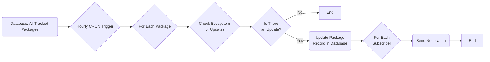

# Patch Pulse Notifier Workflow

This package lives in the Patch Pulse monorepo at `packages/notifier-bot`.

This document describes how the Patch Pulse works.

## Polling

A CRON job is run every _interval_ (currently 1 hour) that checks all our ecosystems (currently only `npm`) if any of the packages in the database have been updated.

If a package has been updated, the package is updated in the database with the new version and all subscribers (currently Slack Workspaces and Discord Channels).

### Diagram

This diagram explains the process in a step-by-step manner:

1. We start with a database that contains all packages being tracked.
2. An hourly CRON job triggers the process.
3. For each package in the database, the relevant ecosystem is checked for updates.
4. If there's no update, the process ends for that package.
5. If there is an update, the package record is updated in the database.
6. For each subscriber of the updated package, a notification is sent.
7. The process ends after all notifications are sent.

## Ecosystems

Currently, only `npm` is supported. Support for other ecosystems is planned.

### npm

The `npm` ecosystem is supported by the [npmjs.com](https://npmjs.com) registry. We fetch the package information using the package name in an api call to `https://registry.npmjs.org/${packageName}/latest` to check if the package has been updated from what we last recorded.

## Subscribers

Currently, only Slack Workspaces and Discord Channels are supported. Support for other subscribers is planned.

### Slack

With Slack workspaces, whenever the Patch Pulse Slack App is added to a workspace, the workspace information along with it's specified channel for the bot is added to the database. The specified channel is then notified whenever a package it is subscribed to is updated.

#### Slack Commands

Current we support the following commands on slack:

- `/npmtrack [package-name]` - Adds the specified npm package to the workspace's list of tracked packages.
- `/npmuntrack [package-name]` - Removes the specified npm package from the workspace's list of tracked packages.
- `/list` - Lists all the packages being tracked by the workspace.

The polling process checks if any of the packages being tracked by a workspace have been updated and notifies the workspace's specified channel if any of them have been updated.

### Discord

wip...
